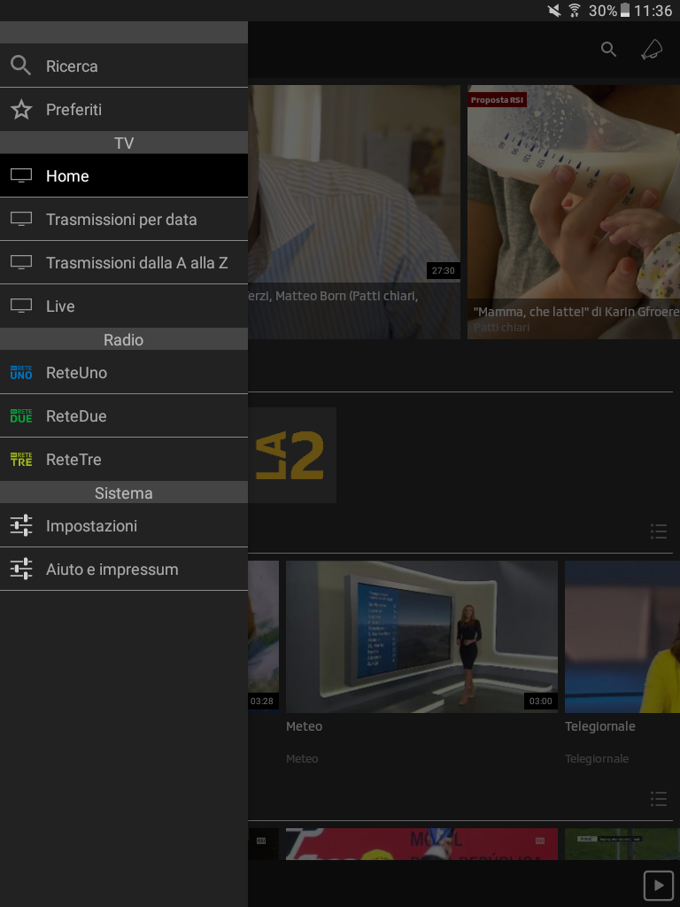
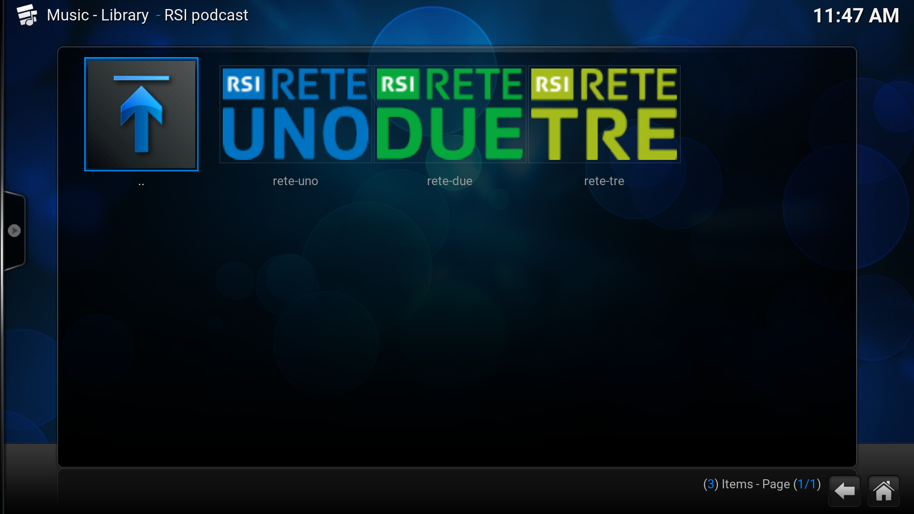

# plugin.audio.rsipodcast
A Kodi plugin to surf through RSI podcasts. It all started with my appreciation for Federico Buffa's pieces, together with Angelo Caruso: *Characters*, *London Calling*, *When we were kings*...

## Showcase
### List of stations

## Technicalities
The json APIs of RSI play are used, this to avoid making uncached calls to the servers. 

### RSI APIs
Episodes view
* List of most recent - http://il.srgssr.ch/integrationlayer/1.0/ue/rsi/audio/editorialPlayerLatestByChannel/rete-tre.json?pageSize=20
* List of most listened to - http://il.srgssr.ch/integrationlayer/1.0/ue/rsi/audio/mostClickedByChannel/rete-tre.json?pageSize=20
* List of assets for a specific radio station - http://il.srgssr.ch/integrationlayer/1.0/ue/rsi/radio/assetGroup/editorialPlayerAlphabeticalByChannel/rete-tre.json
Show view
* List of episoded of a specific show - http://il.srgssr.ch/integrationlayer/1.0/ue/rsi/assetSet/listByAssetGroup/3703891.json
  * go through the list: `?pageNumber=3`
Playing view
* Episode's details - http://il.srgssr.ch/integrationlayer/1.0/ue/rsi/audio/play/8092102.json

### Image scaling server
* Thumb - EPISODE_IMAGE
* FanARt - WEBVISUAL
I.e. http://www.rsi.ch/rsi-api/resize/image/EPISODE_IMAGE/5644198/
I.e. http://www.rsi.ch/rsi-api/resize/image/EPISODE_IMAGE/8310520//scale/width/321